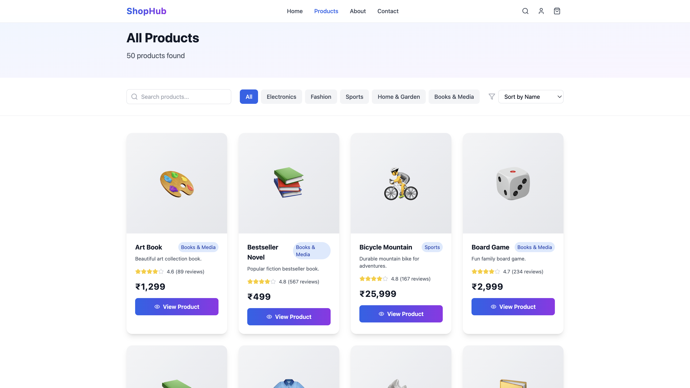
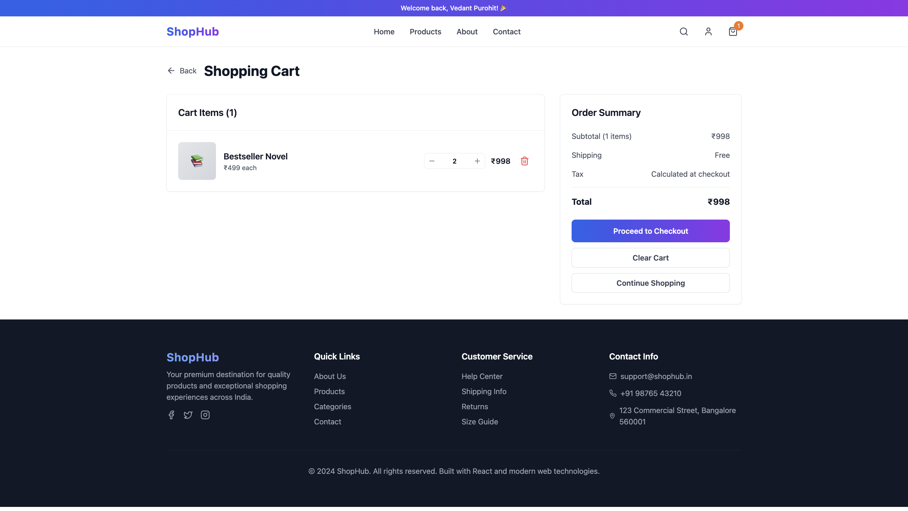
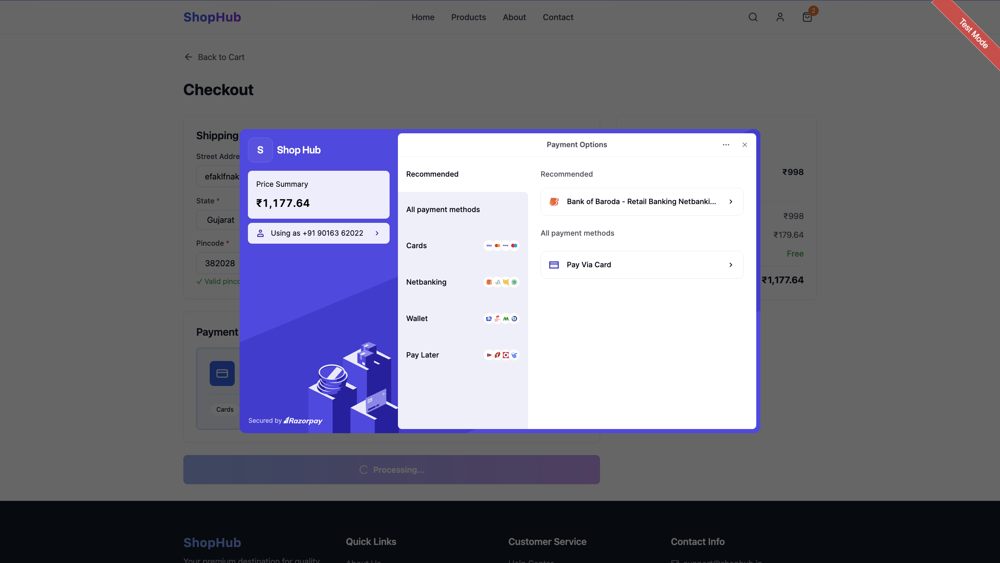
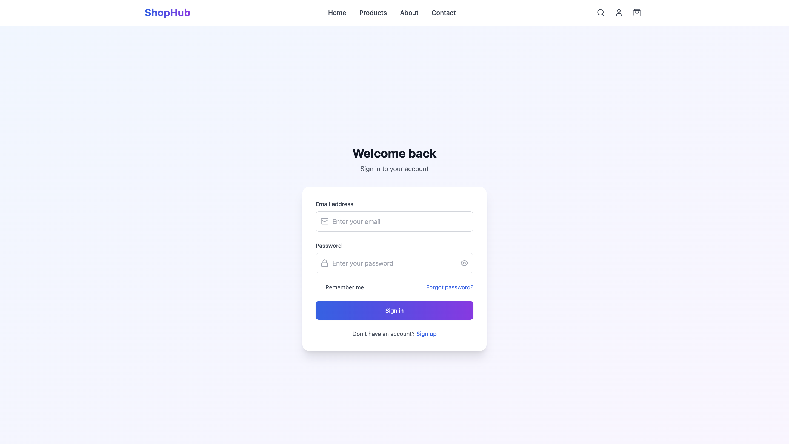
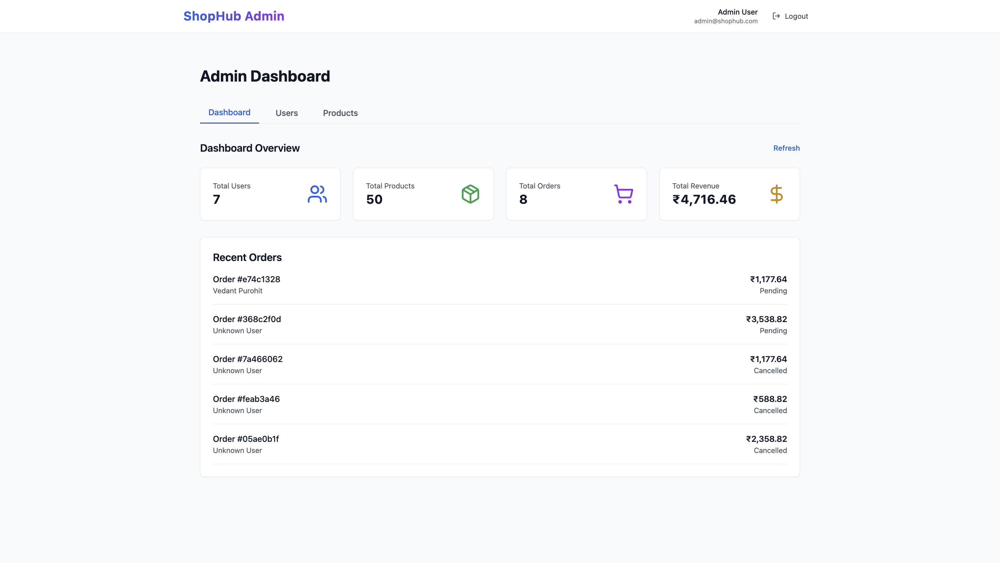
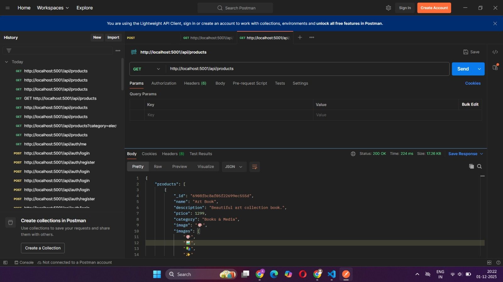

# Shop Hub - Project Report

### Project Team

1. **Vedant Purohit** - 202412078
2. **Ayush Shah** - 202412092

**GitHub Repository:** [https://github.com/vedant208purohit/shop-hub-208.git](https://github.com/vedant208purohit/shop-hub-208.git)

---

## Executive Summary

Shop Hub is a full-stack e-commerce web application built using the MERN (MongoDB, Express.js, React, Node.js) stack. The platform provides a complete online shopping experience with features including user authentication, product management, shopping cart, secure payment processing, and an administrative dashboard.

## 1. Project Overview

### 1.1 Purpose

The primary purpose of this project is to create a modern, scalable e-commerce platform that demonstrates proficiency in full-stack web development, including frontend and backend integration, database management, payment processing, and user authentication.

### 1.2 Objectives

- Develop a responsive, user-friendly e-commerce interface
- Implement secure user authentication and authorization
- Create a robust product catalog with search and filtering
- Integrate secure payment processing
- Build an admin dashboard for managing products and users
- Ensure data persistence and order management

## 2. Technology Stack

### 2.1 Frontend Technologies

- **React 18** with TypeScript for type-safe component development
- **Vite** for fast development and optimized builds
- **Tailwind CSS** for responsive, utility-first styling
- **React Router DOM** for client-side navigation
- **Axios** for HTTP requests to backend API
- **Shadcn UI** for pre-built, accessible components
- **Lucide React** for modern iconography

### 2.2 Backend Technologies

- **Node.js** as the runtime environment
- **Express.js** as the web application framework
- **MongoDB** with Mongoose for database operations
- **JWT (JSON Web Tokens)** for secure authentication
- **Razorpay** for payment gateway integration
- **EJS** for server-side rendering
- **Morgan** for HTTP request logging
- **CORS** for cross-origin resource sharing

## 3. Main Functionalities

### 3.1 User Authentication

- **Registration**: New users can create accounts with email, password, and personal information
- **Login**: Secure authentication using JWT tokens
- **Session Management**: Persistent login sessions with token storage
- **Profile Management**: Users can update their profile information

### 3.2 Product Management

- **Product Catalog**: Browse all available products with pagination
- **Search Functionality**: Search products by name or description
- **Category Filtering**: Filter products by category (Electronics, Fashion, Sports, etc.)
- **Product Details**: View detailed product information including images, price, and description
- **Sorting Options**: Sort products by name, price (low to high/high to low), or rating

### 3.3 Shopping Cart

- **Add to Cart**: Add products to shopping cart
- **Cart Persistence**: Cart items persist across browser sessions using localStorage
- **Quantity Management**: Update product quantities in cart
- **Remove Items**: Remove items from cart
- **Real-time Updates**: Cart updates reflect immediately across the application

### 3.4 Checkout & Payment

- **Shipping Address**: Form with validation for Indian states, cities, and pincodes
- **Address Validation**:
  - Dropdown menus for all Indian states
  - Dynamic city dropdown based on selected state
  - Pincode validation (6 digits, must start with 1-9)
  - **Pincode-City Matching**: Validates that entered pincode belongs to selected city
  - Real-time validation with error messages
- **Payment Integration**: Razorpay payment gateway for secure transactions
- **Order Creation**: Automatic order creation upon successful payment with estimated delivery date
- **Order Confirmation**: Payment success page with order details and estimated arrival date

### 3.5 Order Management

- **Order History**: View all past orders with details (cancelled orders excluded)
- **Order Status**: Track order status (pending, processing, shipped, delivered, cancelled)
- **Estimated Delivery**: Automatic calculation and display of estimated delivery dates (5-7 days from order)
- **Auto Status Update**: Orders automatically update from "pending" to "delivered" when estimated date arrives
  - Runs on server startup, every hour, and when orders are fetched
  - Updates all users' orders automatically
- **Order Cancellation**:
  - Users can cancel orders one day before estimated delivery date
  - Cancellation validation prevents late cancellations
  - Refund message: "Refund will be transferred in 7-10 working days"
  - Cancelled orders moved to separate "Cancelled Orders" page
- **Order Details**: View complete order information including items, shipping address, payment details, and estimated delivery

### 3.6 Admin Dashboard

- **Admin-Only Interface**:
  - Separate admin layout (AdminLayout) without shopping navigation
  - Dedicated admin header with logout functionality
  - No access to shopping pages or cart functionality
- **Access Control**:
  - Protected routes automatically redirect admins to admin panel
  - Admins cannot access regular shopping pages (home, products, cart, etc.)
  - Admin login automatically redirects to `/admin` dashboard
- **Cart Restrictions**:
  - Admins cannot add items to cart (blocked at CartContext level)
  - Error messages shown if admin attempts to add to cart
  - Shopping functionality completely disabled for admin role
- **User Management**:
  - View all registered users with details (name, email, role, phone)
  - Delete users (prevents admin from deleting themselves)
  - User role management
- **Product Management**:
  - Create new products with full details (name, description, price, category, stock, images)
  - Update existing products
  - Delete products
  - View all products in grid layout
- **Statistics Dashboard**:
  - Total users count
  - Total products count
  - Total orders count
  - **Accurate Revenue Calculation**:
    - Only counts non-cancelled orders
    - Only includes orders with completed payment status
    - Excludes all cancelled orders from revenue
    - Shows ₹0 when all orders are cancelled
    - Updates only when users successfully complete purchases
  - Recent orders display with user and product information
- **Order Management**: Update order statuses (pending, processing, shipped, delivered, cancelled)

### 3.7 Additional Features

- **Pincode Validation**:
  - Check delivery serviceability using India Post API
  - Validate pincode format (6 digits, starts with 1-9)
  - Match pincode with selected city to ensure accuracy
  - Real-time validation with helpful error messages
- **Cancelled Orders Management**:
  - Separate page to view all cancelled orders
  - Shows cancellation date and refund information
  - Link from My Orders page for easy access
- **Cart Persistence**:
  - Cart items saved to localStorage per user
  - Cart persists across logout/login sessions
  - User-specific cart management
- **Responsive Design**: Mobile-first approach ensuring compatibility across all devices
- **Form Validation**: Comprehensive validation for all user inputs with real-time feedback
- **Error Handling**: User-friendly error messages and notifications
- **Server-Side Rendering**: EJS templates for home and about pages

## 4. Project Structure

### 4.1 Frontend Structure

```
src/
├── components/        # Reusable UI components
├── pages/            # Page components
├── context/          # React Context for state management
├── services/         # API services
├── data/            # Static data files
├── hooks/           # Custom React hooks
└── lib/             # Utility functions
```

### 4.2 Backend Structure

```
backend/
├── config/          # Configuration files (database)
├── middleware/      # Custom middleware (authentication)
├── models/          # Mongoose schemas
├── routes/          # API route handlers
├── utils/           # Utility functions
├── views/           # EJS templates
└── public/          # Static files
```

## 5. API Documentation

### 5.1 Authentication Endpoints

- `POST /api/auth/register` - User registration
- `POST /api/auth/login` - User login
- `GET /api/auth/me` - Get current user
- `PUT /api/auth/profile` - Update user profile

### 5.2 Product Endpoints

- `GET /api/products` - Get all products (with filters)
- `GET /api/products/:id` - Get product by ID
- `POST /api/products` - Create product (Admin)
- `PUT /api/products/:id` - Update product (Admin)
- `PATCH /api/products/:id` - Partially update product (Admin)
- `DELETE /api/products/:id` - Delete product (Admin)

### 5.3 Order Endpoints

- `POST /api/orders` - Create order
- `GET /api/orders` - Get user's orders (excludes cancelled orders)
- `GET /api/orders/cancelled` - Get user's cancelled orders
- `GET /api/orders/:id` - Get order by ID
- `PUT /api/orders/:id/cancel` - Cancel order (one day before estimated delivery)
- `PUT /api/orders/:id/status` - Update order status (Admin)

### 5.4 Payment Endpoints

- `POST /api/payments/create-order` - Create Razorpay order
- `POST /api/payments/verify-payment` - Verify payment

### 5.5 Admin Endpoints

- `GET /api/admin/users` - Get all users (excludes passwords)
- `PUT /api/admin/users/:id` - Update user details
- `DELETE /api/admin/users/:id` - Delete user (prevents self-deletion)
- `GET /api/admin/stats` - Get dashboard statistics
  - Returns: totalUsers, totalProducts, totalOrders, totalRevenue, recentOrders
  - Revenue calculation excludes cancelled orders
  - Only counts orders with completed payment status

## 6. Database Schema

### 6.1 User Model

- \_id, name, email, password (hashed), phone, address, role, createdAt

### 6.2 Product Model

- \_id, name, description, price, category, image, stock, rating, createdAt

### 6.3 Order Model

- \_id, user, items, shippingAddress, totalAmount, paymentMethod, paymentStatus, orderStatus, orderDate, estimatedArrivalDate, deliveredAt, cancelledAt, razorpayOrderId, razorpayPaymentId, razorpaySignature

## 7. Security Features

- Password hashing using bcryptjs
- JWT token-based authentication
- Protected routes with middleware
- Admin role-based access control
  - Separate admin interface isolated from shopping features
  - Route protection prevents admin access to shopping pages
  - Cart functionality disabled for admin role
- Environment variables for sensitive data
- CORS configuration for API security
- Admin middleware validates admin role before allowing access

## 8. Third-Party Integrations

### 8.1 Razorpay Payment Gateway

- Secure payment processing
- Order creation and verification
- Payment status tracking

### 8.2 India Post Pincode API

- Pincode validation and format checking
- Delivery serviceability check
- Location information retrieval (city, district, state)
- Pincode-city matching validation for checkout
- Uses native fetch API (requirement fulfillment)

## 9. Deployment Considerations

- Environment variables configuration
- MongoDB Atlas for cloud database
- Frontend build optimization
- API URL configuration for production
- Security headers and CORS settings

## 10. Latest Updates & Features

### 10.1 Order Cancellation System

- Users can cancel orders one day before estimated delivery
- Automatic validation prevents late cancellations
- Refund processing information displayed
- Separate cancelled orders page for better organization

### 10.2 Enhanced Checkout Validation

- State and city dropdown menus (all Indian states and cities)
- Pincode format validation (6 digits, starts with 1-9)
- Pincode-city matching validation
- Real-time error messages and validation feedback

### 10.3 Automatic Order Status Management

- Estimated delivery date calculation (5-7 days from order)
- Automatic status update from "pending" to "delivered"
- System-wide updates for all users and all orders
- Runs on server startup, hourly, and on order fetch

### 10.4 Cart Persistence

- Cart items saved per user in localStorage
- Cart persists across logout/login sessions
- User-specific cart management

### 10.5 Admin Dashboard Enhancements

- **Separate Admin Interface**:
  - AdminLayout component provides dedicated admin-only interface
  - No shopping navigation or cart functionality
  - Clean, focused admin experience
- **Access Control System**:
  - ProtectedRoute component blocks admins from shopping pages
  - Automatic redirection to admin panel
  - Admin login redirects directly to `/admin`
- **Cart Restrictions**:
  - CartContext checks admin role before allowing add to cart
  - ProductCard and ProductDetails components prevent admin cart access
  - Clear error messages for admin cart attempts
- **Revenue Calculation Improvements**:
  - MongoDB aggregation query filters out cancelled orders
  - Only counts orders with `paymentStatus: 'completed'` AND `orderStatus !== 'cancelled'`
  - Accurate revenue tracking that reflects actual successful transactions
  - Revenue shows ₹0 when all orders are cancelled
  - Updates only when users complete purchases (non-cancelled orders)
- **Enhanced Dashboard**:
  - Real-time statistics with accurate revenue
  - Recent orders with populated user and product data
  - Empty states for users and products tables
  - Refresh buttons on all dashboard tabs
  - Better error handling and loading states

## 📸 Screenshots

### Main Pages

1. **Home Page** - Hero section, categories, featured products, pincode checker
   

2. **Products Page** - Product listing with filters and search
   

3. **Product Details** - Product information, image gallery, add to cart
   

4. **Shopping Cart** - Cart items with quantity management
   

5. **Checkout Page** - Shipping address form with state/city dropdowns and pincode validation
   

6. **Payment Success** - Order confirmation with details and estimated delivery
   

7. **My Orders** - Order history with estimated delivery dates and cancel functionality
   

8. **Payment** - Payment Interface
   

9. **Login/Signup** - Authentication pages with welcome messages
   
   

10. **Admin Dashboard** - Dedicated admin interface with user management, product management, and accurate statistics
    

11. **POST/auth/login** - API POST/auth/login
    

12. **POST/auth/signup** - API POST/auth/signup
    

13. **GET/products** - API GET/products
    

14. **GET/products/id** - API GET/products/id
    

## 11. Future Enhancements

- Product reviews and ratings
- Wishlist functionality
- Email notifications for order updates
- Advanced search with filters
- Product recommendations
- Multi-language support
- Progressive Web App (PWA) features
- Real-time order tracking
- Multiple payment methods

## 12. Conclusion

Shop Hub successfully demonstrates a complete e-commerce solution with modern web technologies. The application includes all essential features for an online shopping platform, from user authentication to payment processing, order management, and cancellation functionality. The platform emphasizes user experience, security, and robust validation mechanisms. With features like automatic order status updates, advanced checkout validation, and comprehensive order management, Shop Hub provides a production-ready e-commerce solution.

---
